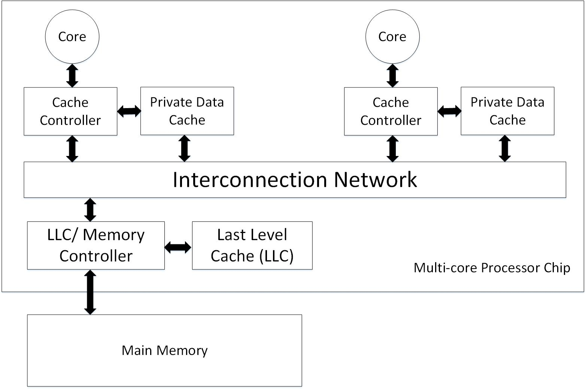

# Coherence Basics
Following figure shows a multi-core system with single-threaded cores which each of them has a private level one cache. Each core's data cache is accessed with physical addresses and is write back.

**Note**: The LLC, despite being on the processor chip, is logically a "memory-side cache" and thus does not introduce another level of coherence issue. It is logically just in front of the MM and serves to reduce the average latency of memory accesses and increase the memory's effective bandwidth. **The LLC also serves as an on-chip memory controller.**.

