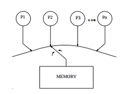

# Memory Consistency and SC Basics
Memory consistency models define the behavior of shared memory systems for programmers and implementors. These models define correctness so that programmers know what to expect and implementors know what to provide.

In the following figure, everyone who looks at it expects that the r2 will be loaded with the new data, but in modern computers, it can be something else.

If core 1 is going to reorder the stores locally, so first it will set the flag to 1 then core 2 will fill r2 with the stale value.

**NOTE**: a core might reorder memory accesses locally as follows:
- Store-Store Reordering: has no effect on a single-threaded execution 
- Load-Load Reordering
- Load-Store and Store-Load Reordering

**NOTE**: The mentioned problem does not relate to the cache coherence. If even our coherence protocol is working correctly, we are going to have the aforementioned problem because of the reorderings of accesses to the main memory.

Following figures show how orders can differ from execution to execution.

For the last one local reordering is done.

**NOTE**: Because modern processors use non-FIFO write buffers for improving performance, so the final execution is conseiderable.

**A Bitter Fact about current multiprocessors**

 All current multiprocessors are non-deterministic; all architectures permit multiple possible interleaving of the executions of concurrent threads.

The illusion of determinism is sometimes created by software with appropriate synchronizations. Thun, we must consider non-determinism when defining shared memory behavior.

In gist to this point, a memory model specifies the allowed behavior of multithreaded programs executing with shared memory. The coherence protocol simply provides the processor core pipeline an abstraction of a memory system. It cannot determine the shared memory behavior; the pipeline core is important too. Finally:
- Cache Coherence does not equal memory consistency.
- A memory consistency implementation can use cache coherence as a useful "BLACK BOX".

## SEQUENTIAL CONSISTENCY (SC)
The most intuitive memory consistency model is sequential consistency (SC). In this model, the order of execution is the same as specified in the program by the programmer. The following figure shows the possible execution of the first program on two cores that respect SC.

**NOTE**: The only non-determinism, especially in this example, is the number of times flag is loaded to be set to be able not to jump and then load R2 with new data, which is not important.

The following figures show different outcomes of execution the second multi-threaded program under SC.

The final emphasis is that SC respects program order specified by the programmer. Memory order always respects the program order.

## SC Implementations
### NAIVE
The terrible implementation of SC can be running a multi-threaded program on a single core by contex-switching between two threads.

### Switch
Each core does its memory operations to the switch one at a time in its program order. Cores can do any optimizations that do not affect the order in which it presents memory operations to the switch. The switch allocation to cores can be done in any policy, for example: switch picks cores randomly or from their index (smaller has higher priority) and wait to satisfy all of their accesses or just let them to do just one access or how many it distinguishes is ok.

However, these implementation are terrible with regard to performance because for example if we have 100 cores, so what is going to happen?

### A BASIC IMPLEMENTATION WITH CACHE COHERENCE
Cache coherence facilitates SC implementations that can execute non-conflicting loads and stores (to different addresses) completely in parallel. Instead of having a switch, we can replace it with a black-box cache coherent memory system.

### Optimized SC Implementation with Cache Coherence
Cores employ optimizatino techniques like prefetching, speculative execution, multi-threading in order to improve performance and tolerate memory access latencies. However, all of these techniques are legal as long as it does not produce an end result that violates SC.

Here I need to know about cache prefetch and speculative execution and Multi-threading!

### Cache Prefetching
### Speculative Execution
### Multi-threading