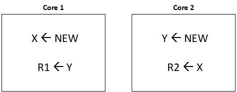
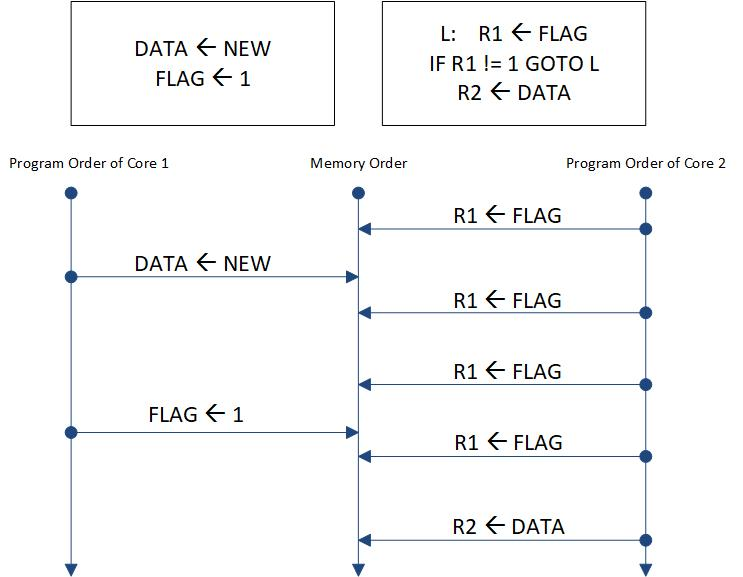
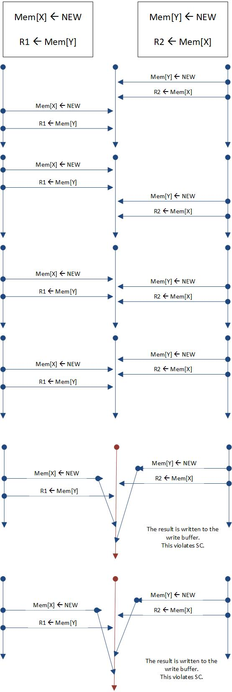
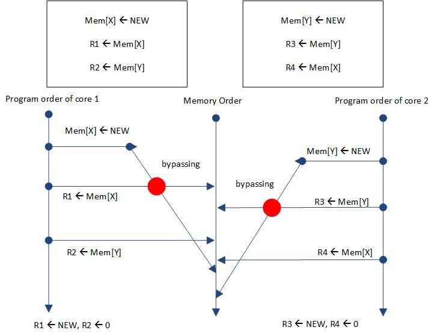
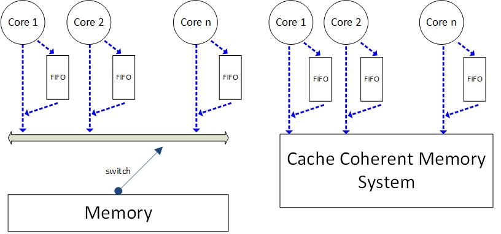

# Total Store Order and the x86 Memory Model
- A widely implemented memory consistency model
- First introduced by SPARC (Scalable Processor Architecture), in part to aid porting of code originally written for x86 or SPARC architectures
- Matches the memory consistency of the widely used X86 architecture
- RISC-V supports a TSO extension (RV-TSO)

## Motivation of TSO/X86
Processors that run out-of-order use write buffers to hold committed (retired) stores until the rest of the memory system could process the stores. A store enters the write buffer when the store commits, and a store exits the write buffer when the block to be written is in the cache in a read-write coherence state.

For a single-core processor, a write buffer can be made architecturally invisible by **by ensuring that a load to a address A returns the value of the most recent store to A even if one or more stores to A are in the write buffer. This is typically done by bypassing the value of the most recent store to A to the load from A, where the most recent is determined by program order.** Other alternative would be stalling a load of A if a store to A is in the write buffer.

However, when in a processor there are several cores with write buffers, those write buffers will not continue to be architecturally invisible.

In the above example, core 1 and core 2 execute stores but they buffer the newly stored value **NEW** in their write buffer. Next, both cores perform their respective loads, L1 and L2, and obtain the old values. This is the result is forbidden by sequential consistency (SC). Without write buffers, the hardware is SC, but with write buffers it is not. The solution can be making write buffers visible by turning them off, but because of the performance improvement they provide, vendors do not like to turn them off or check the violations because it is very expensive and needs very complicated structures. So, the option chosen by SPARC and x86 was to abandon SC in favor of a memory consistency that allows straightword use of FIFO write buffers at each core. 

The new model, TSO, allows the result mentioned in the above example. This model astonishes some people but, it behaves like SC for most programming idioms and is well defined in add cases.

--- 

As we have known that SC model requires each core preserving the program order as follows:
- Load --> Load
- Load --> Store
- Store --> Store (This constraint on TSO means that the write buffer should be a FIFO.)
- Store --> Load (when this constraint is omitted from TSO cores will be able to have write buffers.)

However, TSO requires the first three constraints but not the forth, which this omission does not matter for most programs, which following example shows the case where TSO is exactly like SC.

The following example shows possible executions of TSO, which first four ones are valid executions in SC manner, but the fifth one is not.

**NOTE**: Programmers and compilers can prevent the execution of the TSO of the cases 5 and 6 in the above example by using FENCE instructions between stores and loads.

**What does a FENCE instruction do?**
A fence instruction, memory fence, membar, or memory barrier, is a type of barrier instruction that causes a CPU or compiler to enforce an ordering constraint on memory operations issued before and after instruction. This typically means that operations issued prior to the barrier are guaranteed to be performed before operations issued after the barrier. Memory barriers are necessary because most modern CPUs employ performance optimizations that can result in out-of-order execution. This reordering of memory operations (loads and stores) normally goes unnoticed within a single thread of execution, but can cause unpredictable behaviour in concurrent programs and device drivers unless carefully controlled. The exact nature of an ordering constraint is hardware dependent and defined by the architecture's memory ordering model. Some architectures provide multiple barriers for enforcing different ordering constraints.

**NOTE**: FENCEs are rarely used by programmers using TSO because it does the right thing for most programs. Nevertheless, FENCEs play an important role for the relaxed models.

Following example shows another example of running a program under TSO memory model:

## Implementation of TSO
Following figure shows 2 different implementations of TSO memory model. The implementation of TSO (Total Store Order) is similar to SC with the addition of per-core FIFO write buffers.

**NOTE**: Multithreading introduces a subtle write buffer issue for TSO. TSO write buffers are logically private to each thread context. Thus, on a multithreaded core, one thread context should never bypass from the wrtie buffer of another thread context. This logical separation can be implemented with per-thread-context write buffers or by using a shared write buffer with entiries tagged by thread-context identifiers that permit bypassing only when tags match.