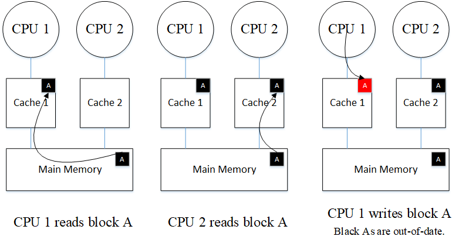

## Memory Consistency and Cache Coherence
Modern computer systems and most multi-core chips share a memory, which is readable and writable by each of the processors (cores). In these designs, architects try to ensure the correnctness of this shared memory alonigside moving towards high performance, low power, and low cost.

Other names of Memory Consistency:
- Consistency
- Memory Consistency Model
- Memory Model

Memory consistecy is a precise, architecturally visible definition of the shared memory correctness. It provides rules about loads and stores and how they act upon memory. When we say correctness, we mean not violating the program order which is arranged by the programmer. If any architect is going to change the order of accesses to the memory, he has to do it in a way that the result is not going to be something else than what is specified in the program by the programmer.

As a part of this consistency model support, the hardware provides cache coherence (coherence).

Problem with shared memory system with several caches is that the cached values can be potentially out-of-date or incoherent when one of the processors updates its cache values. The aforementioned problem can be seen in the following figure.

**The vision of cache coherence that every computer architect must have**: Coherence seeks to make the caches of a shared-memory system invisible as functionally invisible in a single-core system, for example it propagates a processor's write to other processors' caches.

**NOTE:** Consistency is an architectural specification that defines shared memory correctness, but cache coherence is a means to supporting a memory consistency model.

Then In the following sections, I will try to summarize the new concepts that I learned.

1. [Coherence Basics](notes/01-coherence_basics.md)
2. [Memory Consistency and SC](notes/02-MC_SC.md)
3. [Total Store Order and the x86 Memory Model](notes/03-TSO.md)
4. [Relaxed Memory Consistency](notes/04-RMC.md)

 - [MM and CC in GPUs and HS](notes/CC_for_HS.md)