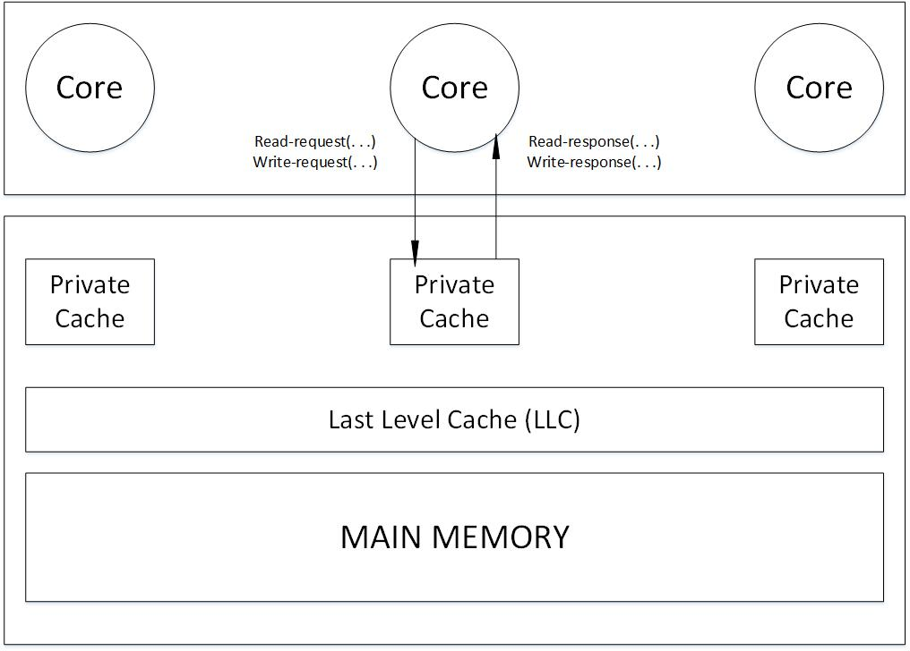
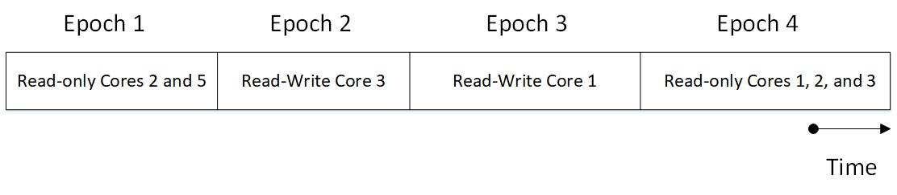

# Coherence Basics
Following figure shows a multi-core system with single-threaded cores which each of them has a private level one cache. Each core's data cache is accessed with physical addresses and is write back.

**Note**: The LLC, despite being on the processor chip, is logically a "memory-side cache" and thus does not introduce another level of coherence issue. It is logically just in front of the MM and serves to reduce the average latency of memory accesses and increase the memory's effective bandwidth. **The LLC also serves as an on-chip memory controller.**.

The major issue that causes incoherence: there multiple actors with access to caches and memory. These actors are:
- Processor cores
- DMA engines
- External devices with R/W accesses to caches and memory

## The Cache Coherence Interface
**Idea**: What is expected from a cache coherence is that it has to ensure that writes to each privates data cache are made visible to all other processors.

Processor cores interact with the coherence protocol through a coherence interface providing 2 methods:
- read request
- write request
It is shown in the following figure.

Cache Coherence Protocols are categorized into two groups (based on whether there is a clean separation of coherence from the consistency model or whether they are invisible):

1.  Consistency-agnostic protocols (synchronous propagation of writes)

In this category, every write is made visible to all other cores, so in this category the inteface is identical to that of **an atomic memory system**. The cache coherence protocol abstracts away the cache and presents an illusion of atomic memory (**the box which contains privates cache, LLC, and main memory looks like a black box as memory, and the order of accesses to the memory are mandated by the consistency model specifications.**).

2.  consistency-directed protocols (asynchronous propagation of writes) ---> support throughput-based GPGPUs

Every write is not made visible, thus stale values can be observed. These protocols should ensure that the order which based on writes are made visible must adhere to the consistency model (or memory model).

In having a real vision on cache coherence, it is defined with two invariants:
- **SWMR (Single Write Multiple Read)**: For any memory location, at any given time, there exists only a single core that may write to that location, or some number of cores that may only read that location.
- **Data-Value Invariant**: The value of the memory location at the start of an epoch is the same as the value of the memory location at the end of that read-write epoch

The following figure gives a vision on read-write epochs.

### Granularity of cache coherence
In theory, coherence could be performed at the finest load/store granularity. However, in practice, coherence is usually maintained at the granularity of **cache blocks**. In practice, the SWMR invariant is likely to be that, for any block of memory, there is either a single writer or some number of readers.

### Relevance of Cache Coherence
- Coherence pertains (= be related directly to) to all storage structures that hold blocks from the shared address space. These structures include the L1 data cache, L2 cache, shared LLC, and MM. These structures also include the L1 instruction cache and Translation Lookaside Buffers (TLBs).
- Coherence is not visible to the programmer. Only, the consistency model is visible to the programmer.

#### What is TLB (Translation Lookaside Buffer)?
To speedup virtual to physical address translation, the processor includes a structure called TLB. Actually, TLB is a cache for translations. It is much smaller and faster than a normal level one data cache. It just keeps the final translation in it, for example if there are 3 level of caches, 3 accesses are needed, but for TLB just one access is needed. If a miss occurs in TLB, the translation using page table(s) is performed, and then the translation is put into the TLB.