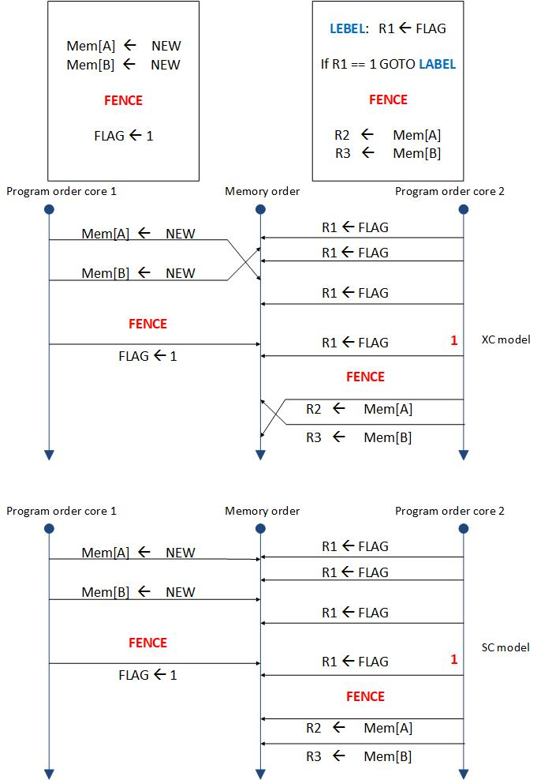
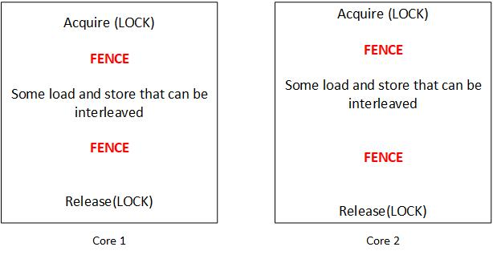

# Relaxed Memory Consistency
These memory models seek to preserve only the orders that programmers **require**. The main benefit of this approach is that forcing fewer ordering constraints can facilitate higher performance by allowing more hardware and software optimizations.

## Motivation
Consider there is a dual-core processor which on each of them, it does not matter how to reorder the loads and stores because these orderings are not going to harm the program on each core, but totally it can end in results that most programmers don't think. However, with defining a critical section on each core (using lock) optimizations on each core can be done for optimizations. In fact, it is what relaxed memory models do.

A relaxed memory model allows any memory orderings unless there is a FENCE between them. The relaxewd memory models forces the programmer to to reason about which operations need to be ordered, which is a drawback, but it also it enables many optimizations that can improve performance.

XC: is an example of relaxed memory consistency model that allows any memory operations reordering for optimizations, and limits them based on the FENCE instructions used by the programmer in the program. In this memory model instead of a FIFO write buffer exisitng in TSO model, here the write buffer is non-FIFO. This memory model does not respect any ordering rule except TSO's just for same memory address. The following example shows an example of a program running in XC and SC memory models:

## RC model (Release Consistency Model)
The gist of this proposal is: Surrounding all synchronization operations with FENCEs is overkill. With a deeper understanding of synchronization, a synchronization acquire needs only a succeeding FENCE, while a synchronization release need only a preceding FENCE (we synchronize for better communication between for example two thread from two different cores avoiding race).

