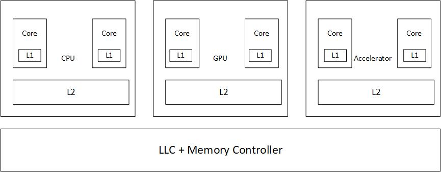

# Cache Cohernece and Memory Consistency in Heterogeneous systems
One promising trend is to expose a global shared memory interface acroos the CPUs and the accelerator in the era of specialization. Heterogeneous systems can be categorized in two group:
- tightly integrated: sharing a physical memory
- loosely integrated: having physically independent memories with a runtime that provides a logical abstraction of shared memory

