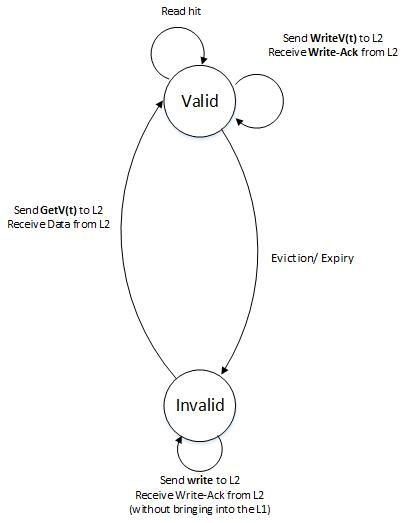
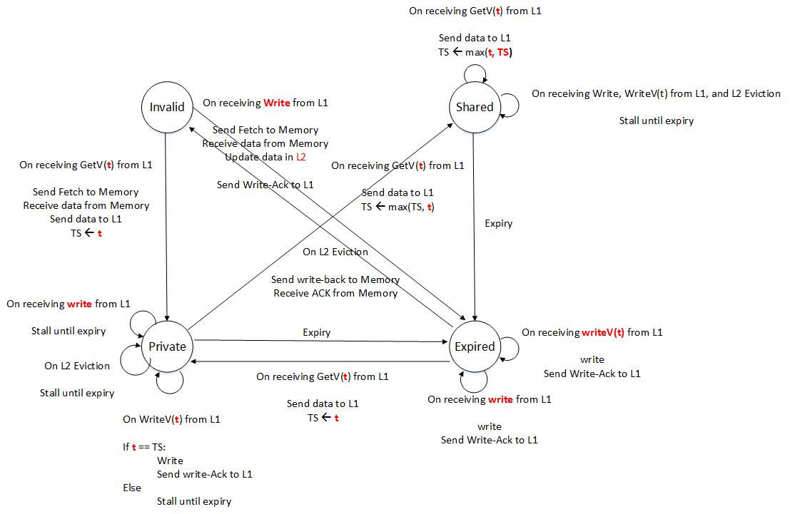
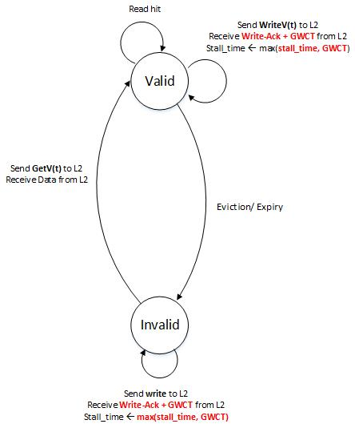
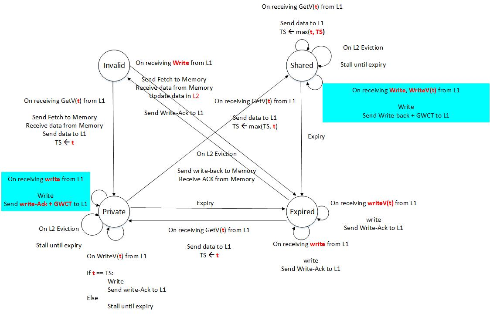
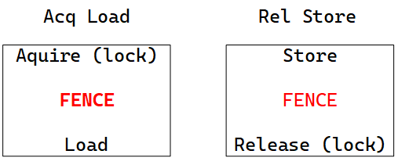
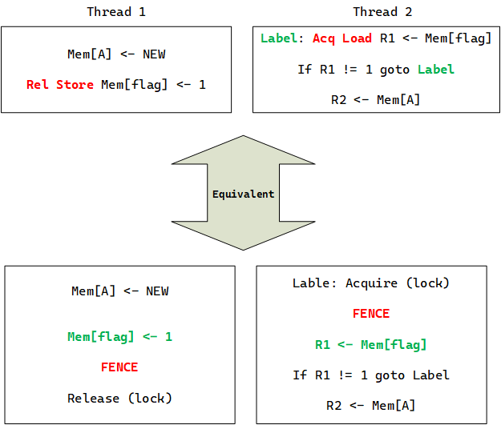
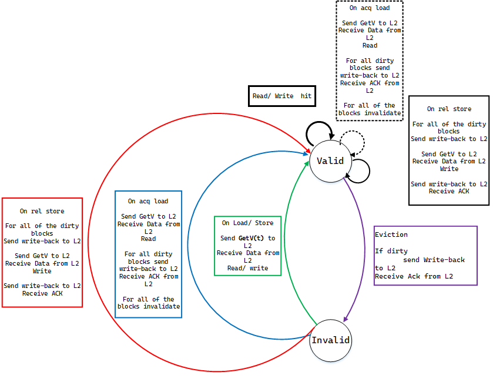
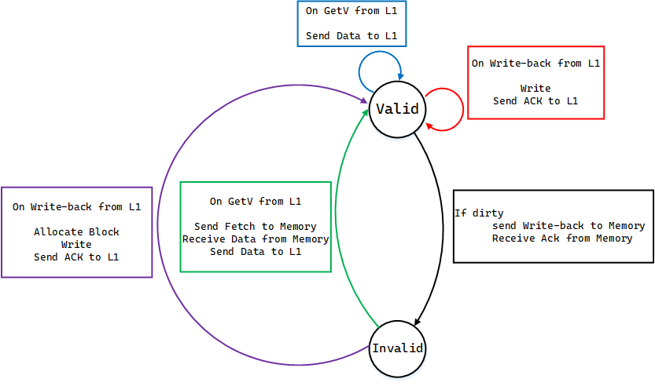

# Cache Cohernece and Memory Consistency in Heterogeneous systems
One promising trend is to expose a global shared memory interface acroos the CPUs and the accelerator in the era of specialization. Heterogeneous systems can be categorized in two group:
- tightly integrated: sharing a physical memory
- loosely integrated: having physically independent memories with a runtime that provides a logical abstraction of shared memory

## GPUs
In GPUs, in order to amortize the cost of fetching and decoding instructions for all of these threads, GPUs typically execute threads in groups called warps. All of the threads in a warp share the PC and the stach, but can still execute independent thread-specific paths using **mask-bits** that specify which threads among the warps are active and whihc threads should execute, and because all threads in a warp share the PC and stack, traditionally the threads in a warp were scheduled togehter. However, GPUs are starting to allow for threads within a warp to have **independent PC and stacks** and conequently allow for the threads to be independently scheduled.

When we say terminology, they mean what we see in the following list:
- CTA scope: SM/ L1
- GPU scope: L2
- System Scope: LLC

How synchronization and communication is done in GPUs?
- Threads from a CTA can synchronize and communicate through the Level 1 cache.
- In the absense of hardware cache coherence, exposing the thread and memory hierarchy to the software allows for programmers and hardeware to cooperatively achieve synchronization efficiently.
- This is why we do L1 bypassing in GPUs, it is for making possible the communication between threads from two threads by writing to level 2 cache by a thread from a SM, and then reading it by another thread from another SM (GPUs consistency models did not allow for explicitely communication and synchronization between threads from different SMs.).

### GPU consistency
GPUs support relaxed memory consistency enforcing only the memory orderings indicated by the programmer, e.g., via FENCE insteructions.

FENCE instrunction in GPUs are CTA-scope effective, it means the FENCE instruction just will enforce the ordering for the threads running on a SM (because of cache coherence protocol's absense).

**NOTE**: Bypassing L1 for synchronization and communication purposes leads to:
- Performance Inefficiency
- Harder programming experience

## GPU Consistency and Coherence
What we want from GPUs in consistency and cohernce?
- A memory model that allows synchronization across all threads
- A coherence protocol that enforces consistency model while allowing for efficient data sharing and synchronization, and keeping the simplicity of GPUs architecture (mainly catering for graphics applications)

We can use one of the CPU-like protocols, but it has it is not going to work well because:
1. A CPU-like coherence protocol that invalidates sharers upon a write would incur a high traffic overhead in GPU context.
2. Because GPUs maintain thousands of active hardware threads, there is a need to track a high number of coherence transactions, which would cost significant hardware overhead.

### Temporal Coherence in GPUs
It is a self-validation approach.

The key idea is that each reader brings in a cache block for a finite period of time called the **lease**, at the end of which time the block is self-validated.

There are two kinds of temporal coherence:
- **A consistency agnostic**: enforces SWMR, in which a writer stalls untill all of the leases for the block expire
- **A relaxed consistency**: Instead of writers, FENCEs stall.

**Assumption**:
- L2 is inclusive
- L1s use a **write-through**/ **no write-allocate** policy: writes are directly written to L2 (write-through) and a write to a block that is not present in the L1 does not allocate a block in the L1 (no write allocate) - it bypasses L1 in fact

#### Consistency-agnostic temporal coherence
**Basic Idea**: Instead of a writer invalidating all sharers in non-local caches, writer is made to wait until all of the sharers have evicted the block.

**But how long to wait? How to know there are no more sharers of the block?**

For this purpose, Temporal coherence leverages a global **notion of time**. It requires that each of the L1s, and the L2 have access to a **register that keeps track of global time**.

When a L1 miss occurs, the reader brings data from the RAM, and it is kept in L2 too, and the reader perdicts how long it expects to hold the block in the L1, and informs the L2 of this time duration known as the **lease**. Every L1 cache block is tagged with a timestamp (TS) that holds the lease for that block. A read for an L1 block with current time greater than its lease is treated as a miss because a write might change its value somewhere in the system.

Every write even the block is present in the L1 cache is written through to the L2; the write request accesses the block's timestamp held in the L2, and if the timestamp is a time in future, the write stalls.

L1 and L2 have differnet FSMs for their controllers for each cache block.

L1's FSM has two states: Valid, Invalid

L1 communicates with L2 using the:
- **GetV(t)**: specifies the block to be brought into the L1 in valid state with a timestamp as a parameter, at the end of which time the block is self-validated.
- **Write**: asks for the specified value to be written through to the L2 without bringing the block into the L1.
- **WriteV(t)**: is used for wrtiing a block that is already valid in L1, and carries a timestamp holding its current lease as a parameter.

L2's FSM has four states:
- **Invalid**: indicating that the block is neither present in L2 nor in any of the L1s
- **Private**: indicating that the block is present in exactly one of the L1s
- **Shared**: indicating that the block may be present in one or more L1s
- **Expired**: indicating that the block is present in L, but not valid in any of the L1s.

**Note**: The purpose of WriteV(t) is to exploit the fact that if the block is held privately held in the L1 of the writer, there is no need for the write to stall at the L2.

**NOTE**: When a cache block is in expired state, it does not mean that it does not mean that it is equal to Invalid, for example see the state change from Expired to Private on GetV(t) from L1 side.

##### DRAWBACK of consistency-agnostic temporal coherence
- Stalling L2 controller causes many threads to stall which finally results in total performance and throughput degradation.

#### Consistency-directed temporal coherence
Instead of making writes visible to all other threads **synchronously** like what we see in consistency-agnostic cache coherence protocols, we can focus on consistency-directed coherence protocols to propagate writes **asynchronously**, in this way the programmer has a key role by using FENCE instructions. For example, XC memory model does not require SWMR (Single Write Multiple Read).

When a write request reaches the L2 and the block is shared, the L2 simply replies back to the thread initiating the write with the timestamp associated with the block. This time is refered as the **Global Write Completion Time (GWCT)** indicating that the time until which the thread must stall upon hitting a FENCE instruction in order to ensure that the write has become globally visible to all threads (Transferring some stalls from the L2 to the SM - L2 is so critical to the total performance of the GPU).

For each thread mapped to an SM, the SM keeps track of the maximum of GWCTs returned for the writes in the per-thread stall-time register. Upon **hitting a FENCE**, stalling the thread until this time ensures that all of the writes before the FENCE have become globally visible.

**NOTE**: The main difference with the L1 controller is due to the fact that that Write-Acks from the L2 now carry GWCTs. Accordingly, upon receiving a Write-Ack, the L1 controller extends the stall-time if the incoming GWCT is greater than the currently held stall-time for that thread (Upon htting a FENCE, the thread is stalled until the time held in the stall-time register).

**Benefit compared to the consistency-agnostic coherence**: This approach eliminates expensive stalling at the L2; instead writes stall at the SM upon hitting a FENCE.

**Possibility**: More optimizations are possible that further reduce salling.

In the following figures FSMs of the L1 and L2 controllers are drawn.

Critical limitations of temporal coherence:
- Its inclusive L2 cache. Supporting a non-inclusive L2 cache is cumbersome because when a block is valid in one or more L1s must have its lease time available at the L2. If the L2 is going to be non-inclusive, on eviction the lease should be kept somewhere like MSHRs (Miss Status Holding Register).

- Global Timestamp: Keeping this time for modern GPUs with a relatively large area could be hard. X. Ren et al. proposed a variant of temporal coherence without using global timestamp:

X. Ren and M. Lis. "Efficient sequential consistency in GPUs via relativistic cache coherence", HPCA 2017

- Performance is sensitive to the choice of the lease period.
  - Too short lease time = increasing L1 miss
  - Too long lease time = longer stalls

- No taking advantage of scoped synchronization. For example, writes in a CTA don't need to be made visible to all threads from other SMs.

### Release Consistency-directed coherence
RCC: Release Consistency-directed Coherence enforcing release consistency (RC), which differs from XC by distinguishing acquires from releases, whereas XC treats all synchronization the same.

**NOTE**: RCC compromises on flexibility, in that it can only enforce variants of RC. But, for this reduced flexibility, RCC is arguably **simpler**, can naturally **exploit scope information** and can be made to work with **non-inclusive L2 cache**.

The afore discussed RC has special atomic operations that order memory accesses in one direction as opposed to the bidirectional ordering enforced by a FENCE. Specially, RC has a release (Rel) store and an acquire (Acq) load that enforce the following orderings.
- **Acq** Load -> Load/ Store
- Load/ Store -> **Rel** Store
- **Rel** Store/ **Acqu** Load -> **Rel** Store/ **Acq** Load

Just for having a deep understading of what is going on when we say Rel Store and Acq load, recall the following figure:

Let's take a look at the following example with the aforementioned atomic instructions of RC memory model:

In the figure above, Rel Store and Acq Load guarantees that R2 will load NEW value.

**NOTE**: In the variant of the memory model **without scopes**, a release synchronizes with an acquire as long as the acquire returns the value written by the release, irrespective of whether the threads to which they belong are from the same scope or different scope.

#### A Scoped RC Model
In this approach, acquires and releases just from a same scope are going to synchronize with each other.

#### Release Consistency-directed Coherence (RCC)
This protocol instead of enforcing SWMR, enforces RC (means that it does not propagate writes to other threads).

In this protocol, writes are written to the L2 upon a release and become visible to another thread when that thread self-invalidates the L1 on an acquire and pulls in new values from the L2.

**Assumption**: Write-back/ Write-Allocate Caches | GPU Scope

- Loads and store that are not marked with acquire or release behave like normal loads and stores in a write-back/ write-allocate L1 caches
- Upon a store marked release, all dirty blocks in the L1, except the one written by the release, are written to the L2. Then, the block written by the release is written to the L2, ensuring **Load/Store -> Rel Store**.
- A load marked acquire reads a fresh copy of the block from the L2. Then, all valid blocks in the L1, other than the one read by the acquire, are self-validated, thereby ensuring **Acq Load -> Load/Store**.

The FMS of the L1 cache controller:

The FSM of the L2 cache controller:

**NOTE**: The RCC protocol can take advantage of CTA scope: a CTA-scoped release does not need to write-back dirty blocks to the L2; a CTA-scoped acquire does not need to self-invalidate any of the valid blocks in the L1.

**NOTE**: Because the L2 does not keep any meta data like sharers or ownership, the L2 cache can be non-inclusive (evictions without informing).

#### RCC - O
Expensive operations of RCC:
- Release: causing all dirty lines to be written back to the L2
- Acquire: causing all valid lines to be self-invalidated

The approach is to reduce the cost of releases and acquires by tracking ownership.